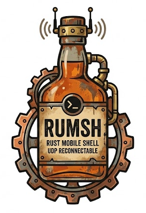

<div align="center">
  
</div>

# Rumsh (Rust Mobile Shell)

**Rumsh** is a shell over UDP transport, very similar to by [Mosh](https://mosh.org/).
The inspiration for Rumsh was the introduction of [libghostty-vt](https://mitchellh.com/writing/libghostty-is-coming)
library, which aims to be the modern and most feature rich terminal library.
Compared to the custom (and notoriously buggy) terminal handling implementation
in Mosh, this should be a huge improvement.

The most obvious and immediate advantage is the modern 24 bit color and kitty
image support in `libghostty-vt`.

## Key Features

- **Terminal Emulation Engine**: Uses `libghostty-vt` for the most modern and
  complete feature set.

- **SSH Connection Bootstrapping**: Just like with Mosh, initial setup happens
  over an SSH connection.

- **UDP State Synchronization**: Uses a custom State Synchronization Protocol
  (SSP) over UDP for quick and efficient layout delivery, running on an
  event-driven channel that drops idle CPU usage.

- **IP Roaming / Resiliency**: Automatically detects when a client changes IP
  addresses or ports and updates the server session dynamically without
  dropping the shell.

- **End-to-End Encryption**: Secure session bootstrapping and encrypted packet
  payload delivery using `ChaCha20-Poly1305` AEAD.

- **Status Overlay**: Status overlay showing roundtrip latency (RTT), accurate
  packet loss rate (with late-arrival corrections), compression ratio, and
  rendering FPS (toggled with `-o` or `--overlay`).

---

## Architecture

Rumsh consists of a single binary (`rumsh`) that can be executed in either
client or server mode. The "client" mode is the default:

- **`rumsh` (Client Mode)**: Captures raw user keystrokes, transmits them
  encrypted to the server, applies PTY layout frame updates to its local VT
  emulator copy, and paints the output onto the physical screen.

- **`rumsh server`**: Spawns the remote shell process (PTY), feeds its output
  into the authoritative VT emulator, packages diff frames, encrypts them, and
  transmits them over UDP.

---

## Building

To build the binary, run:

```bash
cargo build --release
```

This will produce the `rumsh` binary in `target/release/`.

---

## Usage & Examples

You can control logging output by setting the `RUST_LOG` environment variable
(e.g., `RUST_LOG=info` or `RUST_LOG=debug`).

### 1. SSH Bootstrap Mode (Default & Recommended)

This is the most common way to use Rumsh, mimicking how Mosh works. Simply pass
the remote SSH target. Rumsh will log in via SSH, spawn the server, and hand
off the session to UDP:

```bash
# Connect to remote host (uses SSH to bootstrap and transitions to UDP)
target/release/rumsh user@remote_host

# Connect with the real-time debugging status overlay enabled in the upper-right corner
target/release/rumsh user@remote_host -o

# Connect and force the remote server to only listen on the localhost interface for security
target/release/rumsh user@remote_host --remote-bind 127.0.0.1
```

_Note: The remote machine must have the `rumsh` binary installed in its path
(defaults to looking for `rumsh`). You can override the binary path using
`--remote-binary`._

### 2. Direct Mode (Manual Connection)

If you cannot use SSH, you can bootstrap the connection manually.

#### Step A: Start the Server

Run the `server` subcommand on the remote machine:

```bash
# Start server (listens on any port in the default range 46500-46600)
target/release/rumsh server --no-daemonize

# Start server binding to a specific port and IP, spawning a Zsh shell
target/release/rumsh server --port 48000 --bind 127.0.0.1 --shell /bin/zsh --no-daemonize
```

Upon boot, the server will output a bootstrap token:

```text
==================================================
Rumsh Server Bootstrapped
RUMSH_PORT=48000
RUMSH_KEY=ac7751b38781669fb691faecdaf432bb154539340aa3368213d3e09751ffcb56
==================================================
```

#### Step B: Connect the Client

Run `rumsh` on your local machine, passing the remote address and the `--key` flag:

```bash
# Connect manually using the token port and key
target/release/rumsh 127.0.0.1:48000 --key ac7751b38781669fb691faecdaf432bb154539340aa3368213d3e09751ffcb56 -o
```

---

## Local Escape Sequences

Just like `ssh`, **Rumsh** supports local escape sequences. Typing a newline
(pressing Enter) followed by the tilde character (`~`) activates the escape
interpreter. The following commands are supported:

- `~.` - **Disconnect**: Gracefully terminates the client connection and closes
  the session.
- `~^Z` - **Suspend**: Suspends the `rumsh` client and returns you to your
  local shell (type `fg` and press Enter to resume your session). The client
  cleanly restores your terminal settings before suspending and restores raw
  mode upon resumption.
- `~o` - **Toggle Overlay**: Dynamically toggles the real-time performance and
  telemetry overlay (RTT, packet loss, bandwidth, FPS) in the top-right corner.
- `~?` - **Help**: Displays a list of available escape sequences. Press any key
  to resume your session.
- `~~` - **Literal Tilde**: Sends a single `~` character to the server by
  typing it twice.

---
